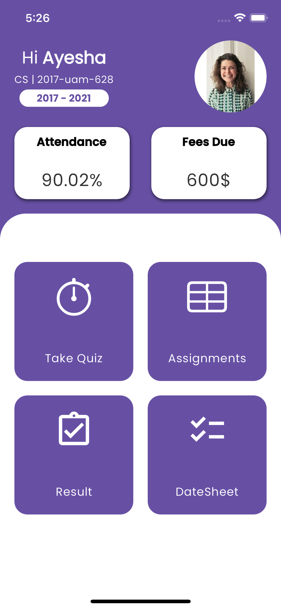
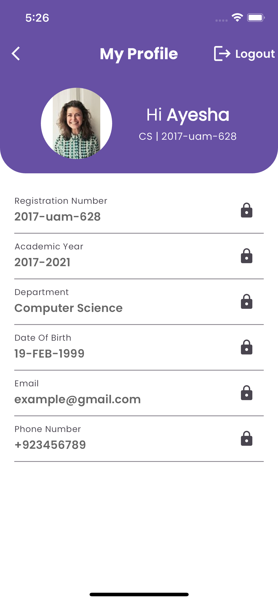
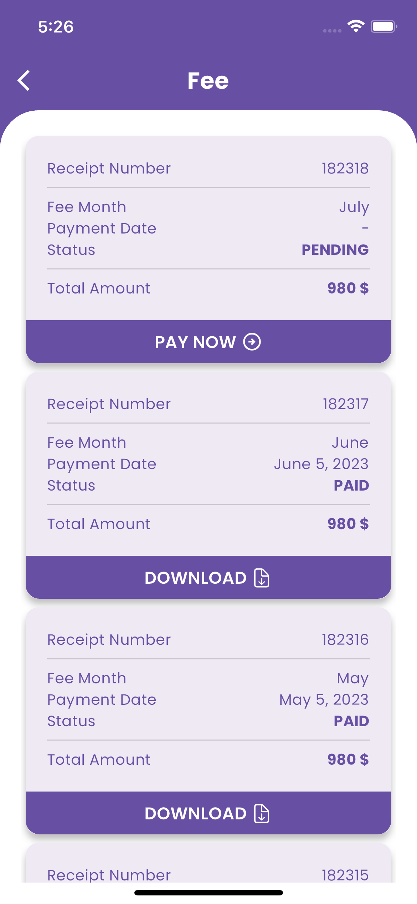
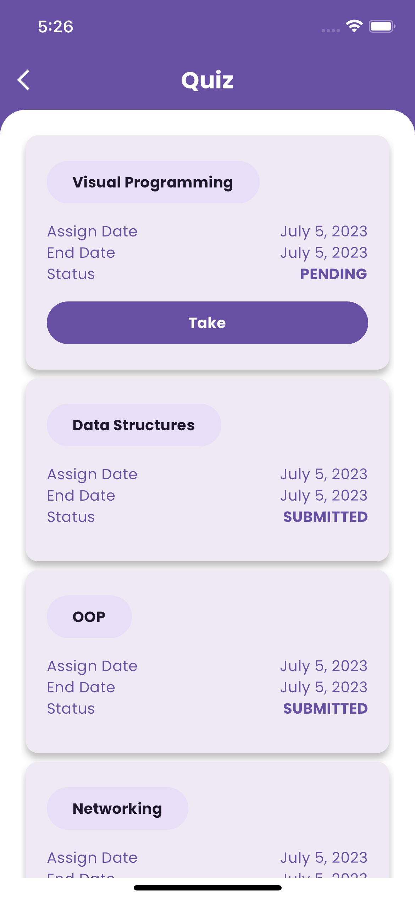
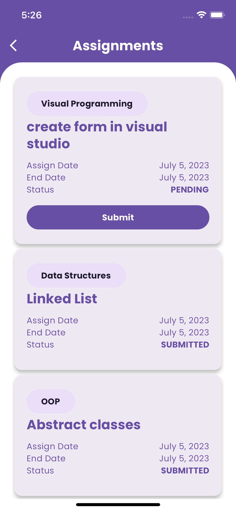
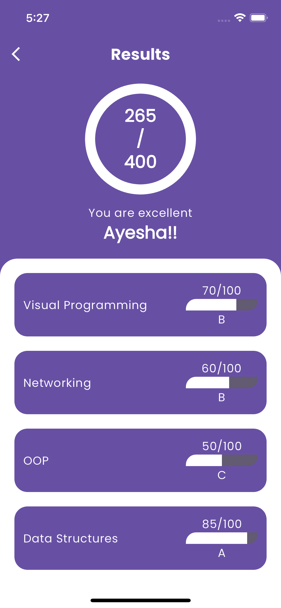
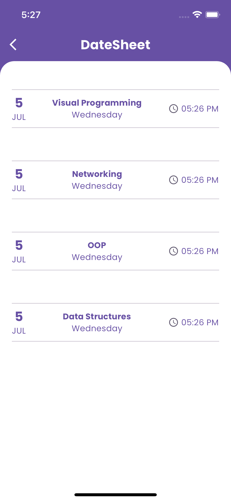
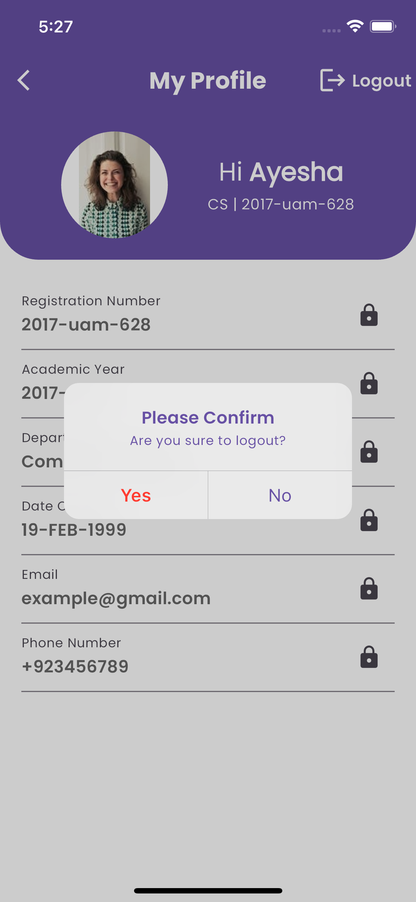

# flutter_getx_mvvm_template

A new Flutter project.

## Getting Started

This project is a starting point for a Flutter application.

This a BoilerPlate for Flutter 3.0 with Getx using MVVM Architecture.

### Screen Shots

  <table>
    <tr>
      <td></td>
      <td></td>
      <td></td>
    <tr>
    <tr>
      <td></td>
      <td></td>
      <td></td>
    </tr>
    <tr>
      <td></td>
      <td></td>
      <td></td>
    </tr>
    <tr>
      <td></td>
      <td></td>
    </tr>
  </table>